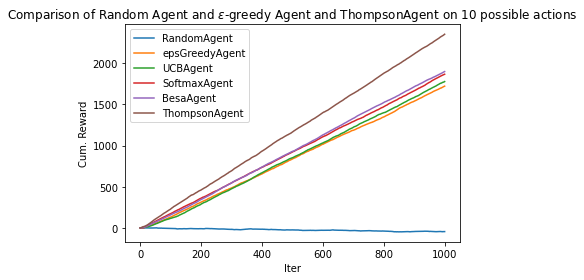

# RL_multi-armed-bandit-problems

In this notebook, four agents have been implemented: 
- UCB1 https://homes.di.unimi.it/~cesabian/Pubblicazioni/ml-02.pdf

- Besa https://hal.archives-ouvertes.fr/hal-01025651v1/document

- Softmax https://www.cs.mcgill.ca/~vkules/bandits.pdf

- Thompson Sampling Agent https://en.wikipedia.org/wiki/Thompson_sampling

## Comparison of the results

